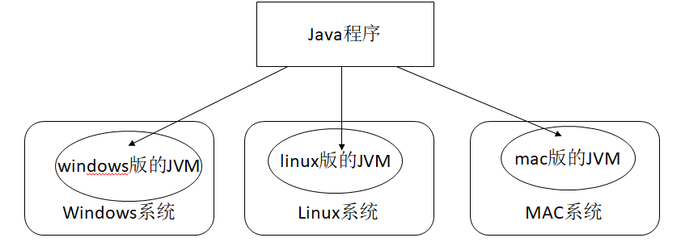
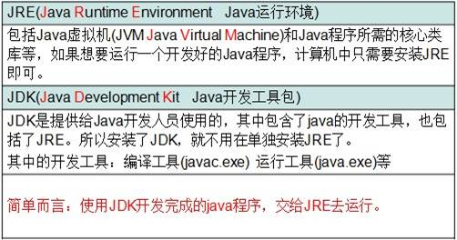
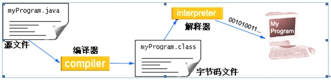

# 01Java语言概述

[TOC]

## Java语言发展史

詹姆斯•高斯林（James Gosling）1977年获得了加拿大卡尔加里大学计算机科学学士学位，1983年获得了美国卡内基梅隆大学计算机科学博士学位，毕业后到IBM工作，设计IBM第一代工作站NeWS系统，但不受重视。后来转至Sun公司，1990年，与Patrick，Naughton和Mike Sheridan等人合作“绿色计划”，后来发展一套语言叫做“Oak”，后改名为Java。 

### SUN

(Stanford University Network斯坦福大学网络公司)
### Java语言版本
* 1995年5月23日，Java语言诞生
* 1996年1月	JDK1.0
* 1997年2月	JDK1.1
* 1998年12月JDK1.2(将Java分成了J2SE,J2EE,J2ME)
* 2000年5月	J2SE1.3
* 2002年2月	J2SE1.4
* 2004年10月 JDK1.5(改名JavaSE5.0,JavaEE,JavaME)
* 2006年12月JavaSE6.0
* 2009年04月20日，甲骨文(Oracle)74亿美元收购Sun。
* 2011年7月 	JavaSE7.0
* 2014年3月	JavaSE8.0

## Java语言平台

### J2SE(Java 2 Platform Standard Edition)标准版

* 为开发普通桌面和商务应用程序提供的解决方案,该技术体系是其他两者的基础，可以完成一些桌面应用程序的开发

### J2ME(Java 2 Platform Micro Edition)小型版

* 为开发电子消费产品和嵌入式设备提供的解决方案

###  J2EE(Java 2 Platform Enterprise Edition)企业版

* 为开发企业环境下的应用程序提供的一套解决方案,该技术体系中包含的技术如 Servlet、Jsp等，主要针对于Web应用程序开发 

## Java语言跨平台原理

- 平台：即操作系统(Windows，Linux，Mac)
- 跨平台：Java程序可以在任意操作系统上运行，一次编写到处运行
- 原理：实现跨平台需要依赖Java的虚拟机 JVM （Java Virtual Machine）



## JVM

JVM是java虚拟机(JVM Java Virtual Machine)，java程序需要运行在虚拟机上，不同平台有自己的虚拟机，因此java语言可以跨平台

## JRE和JDK

JRE:JVM+类库



JDK:JRE+JAVA开发工具

## 常用DOS命令

###打开控制台

- win + R，然后cmd回车

### 常用命令

- d: 回车	盘符切换
- dir(directory):列出当前目录下的文件以及文件夹
- cd (change directory)改变指定目录(进入指定目录)
- 进入	cd 目录；cd 多级目录
- 回退	cd.. 或 cd\
- cls : (clear screen)清屏
- exit : 退出dos命令行

## JDK的下载及安装

## Path环境变量的配置

- 为什么要配置
程序的编译和执行需要使用到javac和java命令，所以只能在bin目录下写程序
实际开发中，不可能把程序写到bin目录下，所以我们必须让javac和java命令在任意目录下能够访问
- 如何配置
	- 创建新的变量名称：JAVA_HOME
	- 计算机-右键属性-高级系统设置-高级-环境变量-系统变量
	- 为JAVA_HOME添加变量值：JDK安装目录
	- 在path环境变量最前面添加如下内容
	%JAVA_HOME%\bin;

## HelloWorld案例

### 执行流程



### 编写代码步骤

1. 首先定义一个类
		public class 类名
2. 在类定义后加上一对大括号
		{}
3. 在大括号中间添加一个主(main)方法/函数
		public static void main(String [] args){ }
	main是程序的入口方法，所有代码的执行都是从main方法开始的

4. 在主方法的大括号中间添加一行输出语句
		System.out.println(“HelloWorld”);

### 完整代码：HelloWorld.java
```
public class HelloWorld {
	public static void main(String [] args) {
		System.out.println(“HelloWorld”);
	}
}
```
### 运行步骤
- 在命令行模式中，输入javac命令对源代码进行编译，生成字节码文件
		javac HelloWorld.java
- 编译完成后，如果没有报错信息，输入java命令对class字节码文件进行解释运行,执行时不需要添加.class扩展名
		java HelloWorld

## HelloWorld案例常见问题

1. 找不到文件
	 a:文件扩展名隐藏导致编译失败
	 注意事项：隐藏已知文件类型的扩展名前面的勾去掉
	 b:文件名写错了
2. 单词拼写问题
	 a:class写成Class
	 b:String写成string
	 c:System写成system
	 d:main写成mian
3. 括号匹配问题
	 a:把类体的那对大括号弄掉一个
	 b:把方法体的那对大括号弄掉一个
	 c:把输出语句的那对小括号弄掉一个
4. 中英文问题
 a:提示信息：错误: 非法字符: \????的格式
	 注意：java编程中需要的基本上都是英文字符
