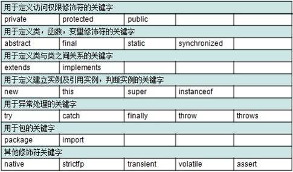
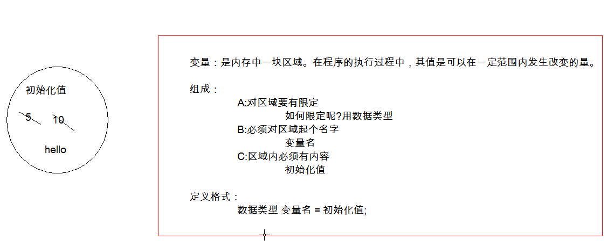
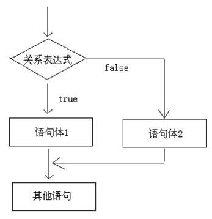
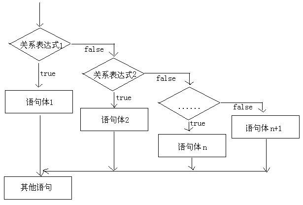
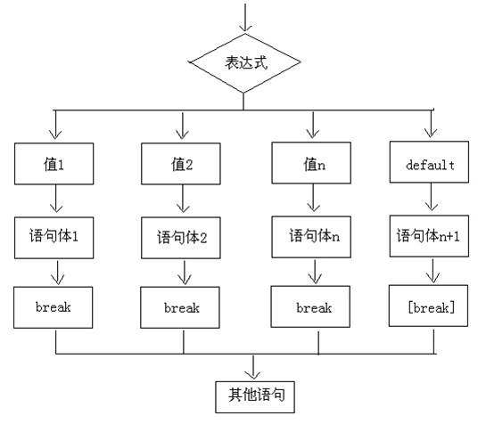
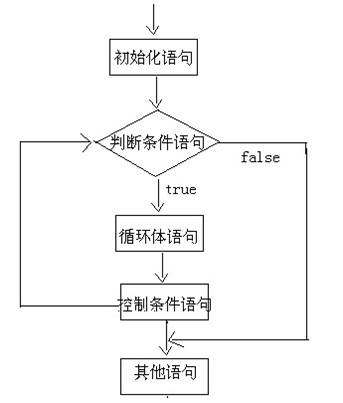
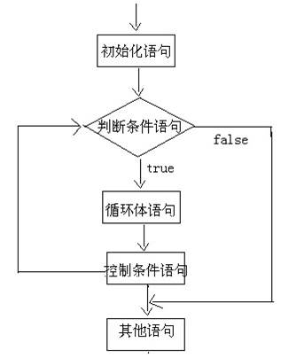

# 02-Java基础语法

[TOC]

## 注释

- 注释概述
用于解释说明程序的文字
- Java中注释分类
	- 单行注释
			格式： //注释文字
	- 多行注释
			格式： /*  注释文字  */
	- 文档注释
			格式：/** 注释文字 */
- 注释的作用
	- 解释说明程序，提高程序的阅读性
	- 帮助我们调试错误

## 关键字

- 关键字概述
被Java语言赋予特定含义的单词
- 关键字特点
组成关键字的字母全部小写
常用的代码编辑器针对关键字有特殊的颜色标记，非常直观，所以不需要死记硬背

	

	

## 常量

- 常量概述
在程序执行的过程中，其值不可以发生改变的量
- 常量分类
	- 字符串常量	用双引号括起来的内容(“HelloWorld”)
	- 整数常量	所有整数(12,-23)
	- 小数常量	所有小数(12.34)
	- 字符常量	用单引号括起来的内容(‘a’,’A’,’0’)
	- 布尔常量	较为特有，只有true和false
	- 空常量		null(数组部分讲解)

## 变量

- 变量概述
在程序执行的过程中，在某个范围内其值可以发生改变的量
从本质上讲，变量其实是内存中的一小块区域
- 变量定义格式
数据类型 变量名 = 初始化值;
注意：格式是固定的，记住格式，以不变应万变


## 数据类型概述

### 计算机存储单元

变量是内存中的小容器，用来存储数据。那么计算机内存是怎么存储数据的呢？无论是内存还是硬盘，计算机存储设备的最小信息单元叫“位（bit）”，我们又称之为“比特位”，通常用小写的字母b表示。而计算机最小的存储单元叫“字节（byte）”，通常用大写字母B表示，字节是由连续的8个位组成。

### 常见的存储单位

- 1B（字节） = 8bit
- 1KB = 1024B
- 1MB = 1024KB
- 1GB = 1024MB
- 1TB = 1024GB

Java语言是强类型语言，对于每一种数据都给出了明确的数据类型，不同的数据类型也分配了不同的内存空间，所以它们表示的数据大小也是不一样的。


- 整数默认int类型，浮点数默认double类型
   所以定义long类型数据的时候要加L，定义float类型数据的时候要加F。

- char 型数据用来表示通常意义上的“字符”
Java 字符采用 Unicode 编码，每个字符占两个字节，所以Java中的字符可以存储一个汉字。
注：Unicode是国际组织制定的可以容纳世界上所有文字和符号的字符编码方案。

- boolean 类型适于逻辑运算，一般用于程序流程控制。
boolean 类型数据只允许取值 true 或 false。占用1个字节即可表示。

## 标识符

- 作用
给包,类,方法,变量等起名字
- 组成规则
由字符，下划线_，美元符$组成
这里的字符采用的是unicode字符集，所以包括英文大小写字母，中文字符，数字字符等。
- 注意事项
不能以数字开头
不能是Java中的关键字
- 命名规则
	- 基本要求
	见名知意
	- 常见命名的规则
		- 包 (其实就是文件夹,用于对类进行管理)
		全部小写，多级包用点隔开。
	com,cn,xyz.lingery
		- 类
		一个单词首字母大写	Student,Car
 		多个单词，每个单词首字母大写	HelloWorld
		- 变量或者方法
		一个单词首字母小写。	age,show()
		多个单词，从第二个单词开始每个单词首字母大写	maxAge,getAge()

## 变量的定义和使用

- 变量的定义格式：
		数据类型 变量名 = 初始化值;
- 基本数据类型：
		byte,short,int,long,float,double,char,boolean
- 注意：
		整数默认是int类型，定义long类型的数据时，要在数据后面加L。
		浮点数默认是double类型，定义float类型的数据时，要在数据后面加F。

### 注意事项

- 变量未赋值,不能直接使用
- 引出变量的第二种使用格式
- 变量只在它所属的范围内有效。
- 变量在哪对大括号内，变量就属于哪对大括号
- 一行上可以定义多个变量，但是不建议

## 类型转换

- 在做运算的时候，一般要求参与运算的数据类型必须一致
boolean类型不能转换为其他的数据类型
- 隐式数据类型转换
取值范围小的数据类型与取值范围大的数据类型进行运算,会先将小的数据类型提升为大的,再运算
默认转换：
byte,short,char—int—long—float—double
byte,short,char相互之间不转换，他们参与运算首先转换为int类型
- 强制转换
		目标类型 变量名=(目标类型)(被转换的数据);
		b = (byte)(a + b);
如果超出了被赋值的数据类型的取值范围得到的结果会与你期望的结果不同，因为损失了精度

## 运算符

#### 运算符

对常量和变量进行操作的符号称为运算符

#### 表达式

用运算符把常量或者变量连接起来符号java语法的式子就可以称为表达式。不同运算符连接的式子体现的是不同类型的表达式。
定义两个int类型的变量a,b，做加法	a + b

#### 常用运算符

- 算术运算符
	- +,-,*,/的基本使用
	- %的使用
	- %和/的区别
	- ++,--（自增自减）
- 赋值运算符
	- 基本的赋值运算符：=
	- 扩展的赋值运算符：+=,-=,*=,/=,…
	+=:	a+=20;相当于a = (a的数据类型)(a + 20);
- 关系运算符
	- ==,!=,>,>=,<,<=
	- 关系运算符的结果都是boolean型，也就是要么是true，要么是false。
	- 注意事项
	关系运算符“==”不能误写成“=” 
- 逻辑运算符
	- 逻辑运算符用于连接布尔型表达式，在Java中不可以写成3<x<6，应该写成x>3 && x<6 。
	- &,|,^,!
	- &&,||
	- “&”和“&&”的区别：	
	单&时，左边无论真假，右边都进行运算；
	双&时，如果左边为真，右边参与运算，如果左边为假，那么右边不参与运算。
	“|”和“||”的区别同理，双或时，左边为真，右边不参与运算
- 三元运算符
	- 格式
	(关系表达式)?表达式1：表达式2；
	如果条件为true，运算后的结果是表达式1；
	如果条件为false，运算后的结果是表达式2；
	- 示例：获取两个数中大数。
	int x=3,y=4,z;
	z = (x>y)?x:y;//z变量存储的就是两个数的大数。

#### 算数运算符取余和除法的区别

- %：取余运算符。得到的是两个相除数据的余数。
- /:除法运算符。得到是两个相除数据的商。 
- 使用场景： %：判断两个数据是否整除。

#### 字符和字符串参与+运算

- 字符参与运算
其实是拿该字符对应的数值（ASIIC码）来操作
‘a’	97
‘A’	65
‘0’	48
- 字符串参与运算
这里其实做的不是加法运算，而是字符串拼接。
字符串和其他类型的数据做拼接，结果是字符串类型的。

#### 算数运算符++和-- 的用法

- ++,--运算符：对变量做加1或者减1的操作。
- ++或者--既可以放在变量的后面，也可以放在变量的前面。
- 单独使用的时候，++或者--无论是放在变量的前面还是后面，结果是一样的。
- 参与操作的时候：
 		如果++或者--在变量的后面，先拿变量参与操作，后变量做++或者--
		 如果++或者--在变量的前面，先变量做++或者--，后拿变量参与操作

## 流程控制语句

在一个程序执行的过程中，各条语句的执行顺序对程序的结果是有直接影响的。也就是说程序的流程对运行结果有直接的影响。所以，我们必须清楚每条语句的执行流程。而且，很多时候我们要通过控制语句的执行顺序来实现我们要完成的功能。

流程控制语句有以下三种：

### 顺序结构

- 概述：是程序中最简单最基本的流程控制，没有特定的语法结构，按照代码的先后顺序，依次执行，程序中大多数的代码都是这样执行的。
- 总的来说：写在前面的先执行，写在后面的后执行
		


### 选择结构

- 也被称为分支结构。
- 选择结构有特定的语法规则，代码要执行具体的逻辑运算进行判断，逻辑运算的结果有两个，所以产生选择，按照不同的选择执行不同的代码。
- Java语言提供了两种选择结构语句
	
#### if语句
if语句有三种格式

```
格式一：
if(关系表达式) {
	语句体
}
	```
- 执行流程
	首先判断关系表达式看其结果是true还是false
	如果是true就执行语句体
	如果是false就不执行语句体


```
格式二
if(关系表达式) {
	语句体1;
}else {
	语句体2;
}
```
- 执行流程
首先判断关系表达式看其结果是true还是false
如果是true就执行语句体1
如果是false就执行语句体2

注意事项和if语句格式1差不多，只不过，这个针对条件不成立，也有一个语句执行。
并且要注意：只有出现了if后面才能有关系表达式，只有else后面是不能出现关系表达式的。

```
格式三：
if(关系表达式1) {
	语句体1;
}else  if (关系表达式2) {
	语句体2;
}
…
else {
	语句体n+1;
}
```
- 执行流程
首先判断关系表达式1看其结果是true还是false
如果是true就执行语句体1
如果是false就继续判断关系表达式2看其结果是true还是false
如果是true就执行语句体2
如果是false就继续判断关系表达式…看其结果是true还是false
…
如果没有任何关系表达式为true，就执行语句体n+1。


#### switch语句

```
格式：
switch(表达式) {
	case 值1：
		语句体1;
		break;
	case 值2：
		语句体2;
		break;
 	…
	default：	
		语句体n+1;
		break;
}
```
- 格式解释
switch表示这是switch语句
表达式的取值：byte,short,int,char
JDK5以后可以是枚举
JDK7以后可以是String
case后面跟的是要和表达式进行比较的值
语句体部分可以是一条或多条语句
break表示中断，结束的意思，可以结束switch语句
default语句表示所有情况都不匹配的时候，就执行该处的内容，和if语句的else相似。
- 执行流程
首先计算出表达式的值
其次，和case依次比较，一旦有对应的值，就会执行相应的语句，在执行的过程中，遇到break就会结束。
最后，如果所有的case都和表达式的值不匹配，就会执行default语句体部分，然后程序结束掉。


### 循环结构

循环语句可以在满足循环条件的情况下，反复执行某一段代码，这段被重复执行的代码被称为循环体语句，当反复执行这个循环体时，需要在合适的时候把循环判断条件修改为false，从而结束循环，否则循环将一直执行下去，形成死循环。

#### 循环语句的组成
- 初始化语句：
一条或者多条语句，这些语句完成一些初始化操作。
- 判断条件语句：
这是一个boolean 表达式，这个表达式能决定是否执行循环体。
- 循环体语句：
这个部分是循环体语句，也就是我们要多次做的事情。
- 控制条件语句：
这个部分在一次循环体结束后，下一次循环判断条件执行前执行。通过用于控制循环条件中的变量，使得循环在合适的时候结束。

```
for循环语句格式：
for(初始化语句;判断条件语句;控制条件语句) {
	循环体语句;
}
```
- 执行流程
A:执行初始化语句
B:执行判断条件语句，看其结果是true还是false
如果是false，循环结束。
如果是true，继续执行。
C:执行循环体语句
D:执行控制条件语句
E:回到B继续


```
while循环语句格式：
基本格式
	while(判断条件语句) {
		循环体语句;
	}
改版格式
   初始化语句;
   while(判断条件语句) {
         循环体语句;
         控制条件语句;
    }
```


```
do…while循环语句格式：
基本格式
   do {
         循环体语句;
   }while((判断条件语句);
改版格式
   初始化语句;
   do {
         循环体语句;
         控制条件语句;
    } while((判断条件语句);

```


#### 三种循环的区别

- 虽然可以完成同样的功能，但是还是有小区别：
do…while循环至少会执行一次循环体。
for循环和while循环只有在条件成立的时候才会去执行循环体
- for循环语句和while循环语句的小区别：
使用区别：控制条件语句所控制的那个变量，在for循环结束后，就不能再被访问到了，而while循环结束还可以继续使用，如果你想继续使用，就用while，否则推荐使用for。原因是for循环结束，该变量就从内存中消失，能够提高内存的使用效率。

## 跳转控制语句

想让循环在某一步的时候结束或者跳过某些数据不要，Java提供了break，continue来实现控制语句的中断和跳转。
### break 中断

- break的使用场景：
在选择结构switch语句中
在循环语句中
离开使用场景的存在是没有意义的
- break的作用：
跳出单层循环

### continue 继续

- continue的使用场景：
在循环语句中
离开使用场景的存在是没有意义的
- continue的作用：
单层循环对比break，然后总结两个的区别
	- break  退出当前循环
	- continue  退出本次循环