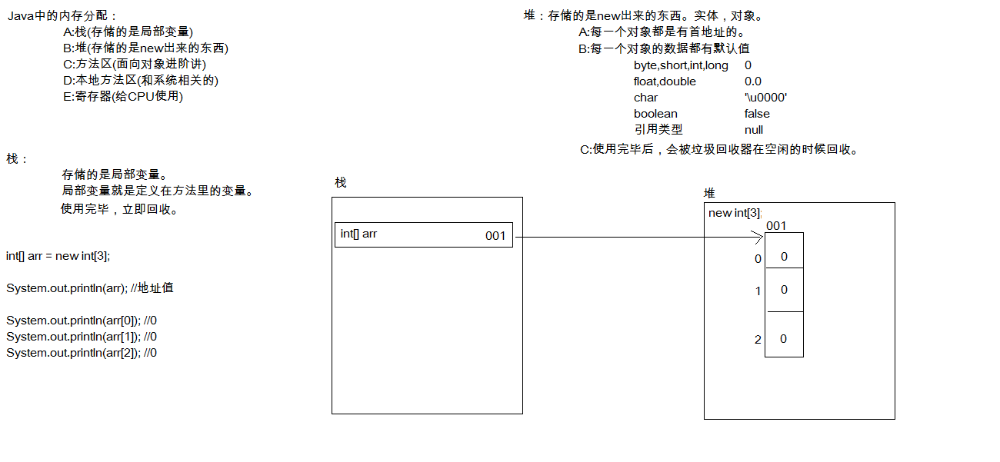

# 03-Java基础语法（下）

## 数组

### 数组概念

- 数组是存储同一种数据类型多个元素的容器。
- 数组既可以存储基本数据类型，也可以存储引用数据类型。

### 数组的定义格式

	格式1：数据类型[] 数组名;
	格式2：数据类型 数组名[];
	int[] a; 定义一个int类型的数组，数组名是a
	int a[]; 定义一个int类型的变量，变量名是a数组

注意：这两种定义做完了，数组中是没有元素值的。

### 数组初始化

- Java中的数组必须先初始化,然后才能使用。
- 初始化：就是为数组中的数组元素分配内存空间，并为每个数组元素赋值。

#### 动态初始化:初始化时只指定数组长度，由系统为数组分配初始值

	格式：数据类型[] 数组名 = new 数据类型[数组长度];
	数组长度其实就是数组中元素的个数。
	int[] arr = new int[3];
- 左边：
int:说明数组中的元素的数据类型是int类型
[]:说明这是一个数组
arr:是数组的名称
- 右边：
new:为数组分配内存空间
int:说明数组中的元素的数据类型是int类型
[]:说明这是一个数组
3:数组的长度，其实就是数组中的元素个数

#### 静态初始化:初始化时指定每个数组元素的初始值，由系统决定数组长度

	格式：数据类型[] 数组名 = new 数据类型[]{元素1,元素2,...};
	int[] arr = new int[]{1,2,3};
	简化格式：数据类型[] 数组名 = {元素1,元素2,...};
	int[] arr = {1,2,3};

### 数组的内存分配

#### JVM内存划分

Java 程序在运行时，需要在内存中的分配空间。为了提高运算效率，就对空间进行了不同区域的划分，因为每一片区域都有特定的处理数据方式和内存管理方式。

##### 一个数组的内存图

定义一个数组，输出数组名及元素。然后给数组中的元素赋值，再次输出数组名及元素

##### 两个数组的内存图

定义两个数组，分别输出数组名及元素。然后分别给数组中的元素赋值，分别再次输出数组名及元素

##### 两个数组指向同一个地址的内存图

定义两个数组，先定义一个数组，赋值，输出。然后定义第二个数组的时候把第一个数组的地址赋值给第二个数组。然后给第二个数组赋值，再次输出两个数组的名及元素

### 数组使用的两个小问题

1. java.lang.ArrayIndexOutOfBoundsException
 数组越界异常
 产生的原因：就是你访问了不存在的索引元素。
2. java.lang.NullPointerException
 空指针异常
 产生的原因：数组已经不指向堆内存的数据了，你还使用数组名去访问元素。

### 数组常用属性：length

用于获取数组的长度

	格式：数组名.length

### 二维数组

二维数组其实就是一个元素为一维数组的数组

#### 二维数组格式

	定义格式
	数据类型[][] 数组名;
	数据类型 数组名[][]; 不推荐
	数据类型[] 数组名[]; 不推荐
	初始化方式
	数据类型[][] 变量名 = new 数据类型[m][n];
	m表示这个二维数组有多少个一维数组，n表示每一个一维数组的元素有多少个
	数据类型[][] 变量名 = new 数据类型[][]{{元素…},{元素…},{元素…}};
	简化版格式：数据类型[][] 变量名 = {{元素…},{元素…},{元素…}};

## 函数与方法

### 方法概述

方法就是完成特定功能的代码块，也叫函数

	方法格式
	修饰符 返回值类型 方法名(参数类型 参数名1，参数类型 参数名2…) {
			方法体;
			return 返回值;
	}
	修饰符 目前记住 public static
	返回值类型 用于限定返回值的数据类型
	方法名 一个名字，为了方便我们调用方法
	参数类型 用于接收调用方法时传入的数据的类型
	参数名  用于接收调用方法时传入的数据的变量
	方法体 完成功能的代码
	return 结束方法，把返回值带给调用者

方法的两个明确：
- 返回值类型 明确功能结果的数据类型
- 参数列表 明确有几个参数，以及参数的类型

有明确返回值的方法调用：
单独调用，没有意义
输出调用，有意义，但是不够好，因为我不一定非要把结果输出
赋值调用，推荐方式

没有明确返回值的函数调用：
其实就是void类型方法的调用
只能单独调用

### 方法重载

在同一个类中，允许存在一个以上的同名方法，只要它们的参数个数或者参数类型不同即可。

方法重载特点
- 与返回值类型无关，只看方法名和参数列表，方法名相同，参数列表不同（参数的个数不同，参数对应的类型不同）
- 在调用时，虚拟机通过参数列表的不同来区分同名方法

注意：在调用方法的时候，java虚拟机会通过参数列表的不同来区分同名的方法

### 方法中参数传递

形式参数：用于接收实际数据的变量
实际参数：实际参与运算的变量

方法的参数是基本类型的时候：形式参数的改变不影响实际参数。

方法的参数是引用类型：形式参数的改变直接影响实际参数

