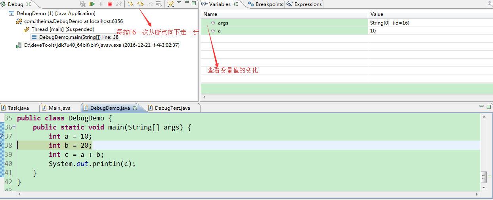
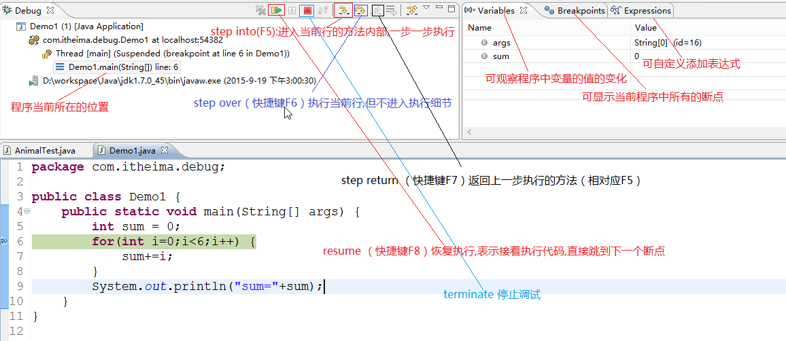

# 03-Eclipse概述

[TOC]

## Eclipse概述和安装

Eclipse是一个IDE(Integrated Development Environment，集成开发环境)
这种软件是用于程序开发环境的应用程序，一般包括代码编辑器，编译器，调试器和图形界面工具。
集成了代码编写功能，分析功能，编译功能，调试功能等一体化的开发软件。

## Eclipse的特点描述

- 免费
- 纯Java语言编写
- 免安装
- 扩展性强

## 下载和安装

- 下载 http://eclipse.org/
- 安装	绿色版	解压就可以使用(Eclipse)

## Eclipse的基本使用

- 选择工作空间
工作空间：其实就是我们写的源代码所在的目录
- 用Eclipse来完成一个HelloWorld案例
- 代码以项目为基本单位
	- 创建项目
	点击File或者在最左侧空白处，在界面中写一个项目名称，然后Finish即可。
	- 创建包
	展开项目，在源包src下建立一个包xyz.lingery
	- 创建类
	在xyz.lingery包下建立一个类HelloWorld，在界面中写一个类名：HelloWorld，可以选择让main方法也被创建。然后finish即可。
	- 编写代码
	在HelloWorld类写main方法，在main方法中写一条输出语句：Hello world！
	- 编译
	自动编译，在保存的那一刻帮你做好了
	- 运行
	右键 -- Run as - Java Application即可

### 自动生成构造方法

 * 代码区域右键 -- Source -- Generate Constructors from Superclass...	无参构造方法
 * 代码区域右键 -- Source -- Generate Constructor using Fields...		带参构造方法
 * 自动生成getXxx()/setXxx():
 * 代码区域右键 -- Source -- Generate Getters and Setters...

## Eclipse中工作空间的基本配置

1. 如何去掉默认注释?
		window -- Preferences -- Java -- Code Style -- Code Templates
	选择你不想要的内容，通过右边Edit编辑。
	注意：请只删除注释部分，不是注释部分的不要删除。
		
2. 行号的显示和隐藏
	显示：在代码区域的最左边的空白区域，右键 -- Show Line Numbers即可。
	隐藏：把上面的动作再做一次。
		
3. 字体大小及颜色
	a：Java代码区域的字体大小和颜色：
		window -- Preferences -- General -- Appearance -- Colors And Fonts -- Java修改 -- Java Edit Text Font
	b:控制台
		window -- Preferences -- General -- Appearance -- Colors And Fonts -- Debug -- Console font
	c:其他文件
		window -- Preferences -- General -- Appearance -- Colors And Fonts -- Basic -- Text Font
		
4. 窗体给弄乱了，怎么办?
		window -- Reset Perspective
		
5. 控制台找不到了，怎么办?
		Window--Show View—Console

## Eclipse中辅助键和快捷键的使用

- 内容辅助键	alt+/
		main	然后alt+/，回车	——自动生成main方法
		syso	然后alt+/，回车	——自动生成输出语句

- 快捷键：注释
		单行	选中内容，ctrl+/, 再来一次取消
		多行	选中内容，ctrl+shift+/, ctrl+shift+\
		格式化		ctrl+shift+f

## Eclipse中项目的删除和导入

- 删除项目
	- 选中项目 – 右键 – 删除
		- 从项目区域中删除
		- 从硬盘上删除
- 导入项目
	- 在项目区域右键找到import	
	- 找到General，展开，并找到Existing Projects into Workspace
	- 点击next,然后选择你要导入的项目
注意：这里选择的是项目名称

## Eclipse断点调试

Eclipse的断点调试可以查看程序的执行流程和解决程序中的bug

	断点调试：查看程序的执行流程，调试程序
	A:什么是断点：
		 就是一个标记，从哪里开始。
	 B:如何设置断点：
		 你想看哪里的程序，你就在那个有效程序的左边双击即可。
	 C:在哪里设置断点：
		 哪里不会点哪里。
		 目前：我们就在每个方法的第一条有效语句上都加。
	 D:如何运行设置断点后的程序：
		 右键 -- Debug as -- Java Application
	 E:看哪些地方：
		 Debug：断点测试的地方，看程序的执行步骤
		 在这个地方，记住F6，或者点击Step Over也可以执行下一步。一次看一行的执行过程。
		 Variables：查看程序的变量变化，创建，赋值，销毁等
		 ForDemo：被查看的源文件
		 Console：控制台
	 F:如何去断点：
		 再次双击即可
		 找到Debug视图，Variables界面，找到Breakpoints，并点击，然后看到所有的断点，最后点击那个双叉。

    

