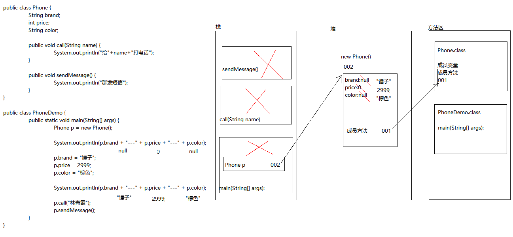
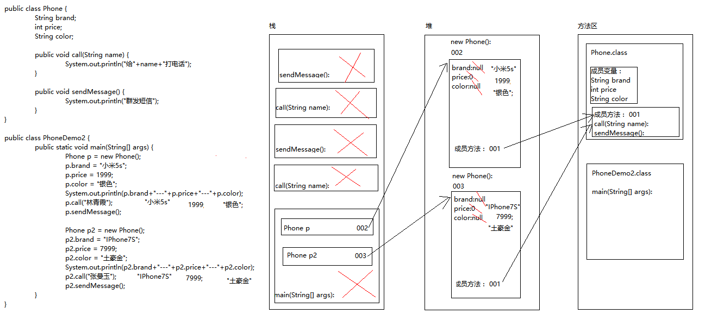
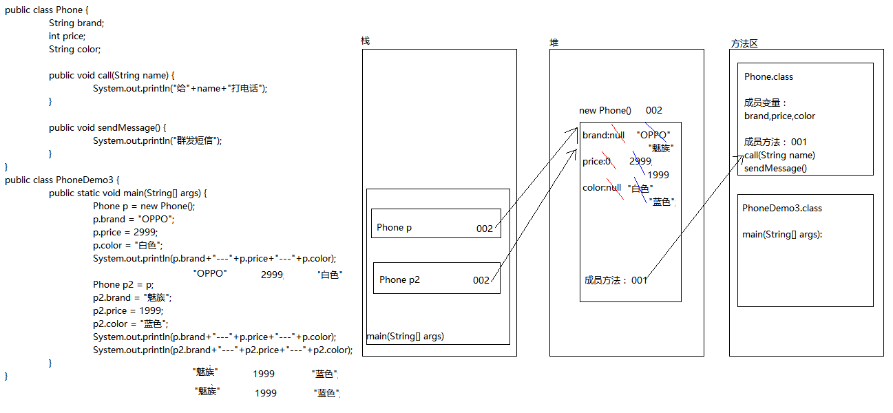
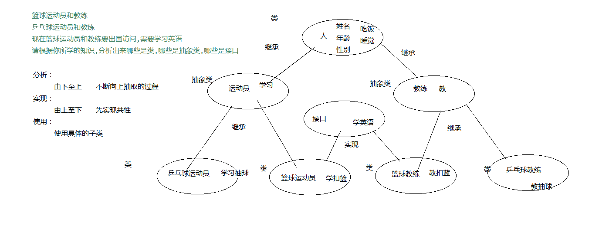
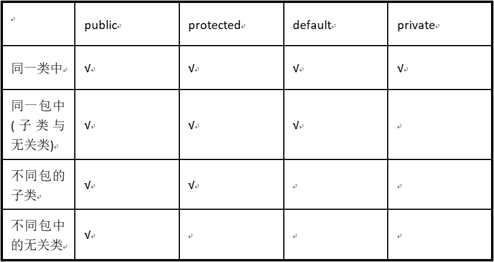
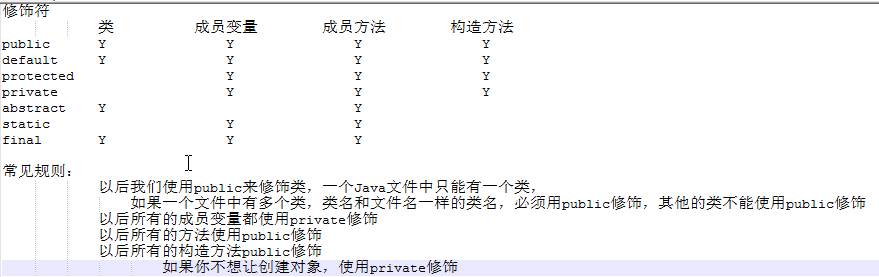

# 05-Java面向对象

[TOC]

## 面向对象概述

面向过程，其实就是面向着具体的每一个步骤和过程，把每一个步骤和过程完成，然后由这些功能方法相互调用，完成需求。

例如:吃煎饼果子利用面向过程的思想:
1. 学习摊煎饼的技术
2. 买材料鸡蛋,油,葱等等
3. 开始摊
4. 吃
5. 收拾

特点：强调的是过程，所有事情都需要自己完成

面向对象思想就是不断的创建对象，使用对象，指挥对象做事情即由对象去调用功能。（如果有对象，直接用对象，对我们直接提供服务），面向对象是基于面向过程的编程思想

例如:吃煎饼果子利用面向对象的思想
1.	找会摊煎饼的大妈(创建一个摊煎饼大妈的对象)
2.	调用其摊煎饼的技能(功能),传递进去钱参数
3.	返回给我们一个煎饼
4.	吃

特点：是一种更符合我们思想习惯的思想(懒人思想，我把事情自己不做，交给别人去做)，可以将复杂的事情简单化（对使用者来说简单了，对象里面还是很复杂的），将我们从执行者变成了指挥者，角色发生了转换

### 类与对象

A:我们学习编程是为了什么
为了把我们日常生活中实物用学习语言描述出来

B:我们如何描述现实世界事物
 属性	就是该事物的描述信息(事物身上的名词)
 行为	就是该事物能够做什么(事物身上的动词)

C:Java中最基本的单位是类,Java中用class描述事物也是如此
 成员变量	就是事物的属性
 成员方法	就是事物的行为

D:定义类其实就是定义类的成员(成员变量和成员方法)
	a:成员变量	和以前定义变量是一样的，只不过位置发生了改变。在类中，方法外。
	b:成员方法	和以前定义方法是一样的，只不过把static去掉，后面在详细讲解static的作用。

E:类和对象的概念
	a:类：是一组相关的属性和行为的集合（我们班所有的同学都具备相同的属性和行为，比如：姓名，年龄，学习，这样就把所有的学生成为学生类）
	b:对象：是该类事物的具体体现（说某个同学时，他都具备自己特有的属性和行为）
	c:举例：
		类	 学生
		对象	 具体的某个学生就是一个对象
	比如：车是一个类，具体的开的奔驰、宝马，就是对象

使用一个类，其实就是使用该类的成员。(成员变量和成员方法)，而我们要想使用一个类的成员，就必须首先拥有该类的对象

	创建对象格式：类名 对象名 = new 类名();
	对象访问成员格式：
		成员变量：对象名.变量名
		成员方法：对象名.方法名(...)

#### 对象的内存图



#### 方法共用内存图



#### 两个引用指向同一个对象内存图



#### 成员变量和局部变量的区别

	A:在类中的位置不同
		成员变量：类中，方法外
		局部变量：方法中或者方法声明上(形式参数)
	B:在内存中的位置不同
		成员变量：堆内存
		局部变量：栈内存
	C:生命周期不同
		成员变量：随着对象的创建而存在，随着对象的消失而消失
		局部变量：随着方法的调用而存在，随着方法的调用完毕而消失
	D:初始化值的问题
		成员变量：有默认值
		局部变量：没有默认值。必须先定义，赋值，最后使用

## 面向对象特性

### 封装

通过对象直接访问成员变量，会存在数据安全问题，为了不让外界的对象直接访问成员变量，使用private关键字封装对象。

```
A:封装概述
是面向对象三大特征之一
是面向对象编程语言对客观世界的模拟，客观世界里成员变量都是隐藏在对象内部的，外界无法直接操作和修改。就像刚才说的年龄。
B:封装原则：
将不需要对外提供的内容都隐藏起来。
把属性隐藏，提供公共方法对其访问。
成员变量private，提供对应的getXxx()/setXxx()方法
C:好处：
通过方法来控制成员变量的操作，提高了代码的安全性
把代码用方法进行封装，提高了代码的复用性
```

#### private关键字

a:是一个权限修饰符。
b:可以修饰成员(成员变量和成员方法)
c:被private修饰的成员只在本类中才能访问。

针对private修饰的成员变量，我们会相应的提供getXxx()和setXxx()用于获取和设置成员变量的值,方法用public修饰

#### this关键字

```
A:this:代表所在类的对象引用
方法被哪个对象调用，this就代表那个对象
B:什么时候使用this呢
局部变量和成员变量重名
```

## 面向对象之构造方法

### 构造方法

主要用来给对象的数据进行初始化

	构造方法格式
	a:方法名与类名相同
	b:没有返回值类型，连void都没有
	c:没有具体的返回值
	调用构造方法格式：类名 对象名 = new 构造方法(...);

#### 构造方法注意事项与重载

如果你不提供构造方法，系统会给出默认构造方法
如果你提供了构造方法，系统将不再提供
构造方法也是可以重载的,重载条件和普通方法相同

	
	A:类:
		a:成员变量
		b:构造方法
			无参构造方法
			带参构造方法
		c:成员方法
			getXxx()
			setXxx()
	B:给成员变量赋值的方式
		a:无参构造方法+setXxx()
		b:带参构造方法

### 类名作为方法形参和返回值

类名作为形式参数要的其实是该类的对象

类名作为返回值返回的其实是该类的对象

## 面向对象之静态关键字static

### 静态的概述

当在定义类的时候，类中都会有相应的属性和方法。而属性和方法都是通过创建本类对象调用的。当在调用对象的某个方法时，这个方法没有访问到对象的特有数据时，方法创建这个对象有些多余。可是不创建对象，方法又调用不了，我们可以通过static关键字不创建对象，就可以调用方法

static它是静态修饰符，一般用来修饰类中的成员。

### 静态的特点


```
A: 被static修饰的成员变量属于类，不属于这个类的某个对象。
（也就是说，多个对象在访问或修改static修饰的成员变量时，其中一个对象将static成员变量值进行了修改，其他对象中的static成员变量值跟着改变，即多个对象共享同一个static成员变量）
B: 被static修饰的成员可以并且建议通过类名直接访问
访问静态成员的格式:
	类名.静态成员变量名
	类名.静态成员方法名(参数)
C: 静态的加载优先于对象,随着类的加载而加载
```

### static的注意事项

静态方法：
 * 可以调用静态的成员变量
 * 可以调用静态的成员方法
 * 不可以调用非静态成员变量
 * 不可以调用非静态成员方法
 * 静态方法只能调用静态的成员
  				
非静态方法：
 * 可以调用静态的成员变量
 * 可以调用静态的成员方法
 * 可以调用非静态的成员变量
 * 可以调用非静态的成员方法		

静态的方法中没有this这个对象

### 静态的优点

对对象的共享数据提供单独空间的存储，节省空间，没有必要每一个对象都存储一份
可以直接被类名调用,不用在堆内存创建对象
静态成员可以通过类名直接访问,相对创建对象访问成员方便

### 静态弊端:

访问出现局限性。（静态虽好，但只能访问静态）

### 静态的应用

#### Math类的使用

A:Math 类包含用于执行基本数学运算的方法。数学操作常用的类。
B:Math类的构造方法被private,无法创建对象,也就无法通过对象来访问Math类中的成员
C:Math类中所有的成员都被静态修饰,因此我们可以直接通过类名访问

#### 自定义工具类

### 类变量与实例变量

A:类变量:其实就是静态变量
定义位置:定义在类中方法外
所在内存区域:方法区
生命周期:随着类的加载而加载
特点:无论创建多少对象,类变量仅在方法区中,并且只有一份

B:实例变量:其实就是非静态变量
定义位置:定义在类中方法外
所在内存区域:堆
生命周期:随着对象的创建而加载
特点:每创建一个对象,堆中的对象中就有一份实例变量

### 代码块

在Java中，使用{}括起来的代码被称为代码块

#### 分类

局部代码块：存在于方法或语句中，控制变量的生命周期（作用域），及早释放，提高内存利用率
以”{}”划定的代码区域，此时只需要关注作用域的不同即可
方法和类都是以代码块的方式划定边界的

构造代码块：是定义在类中成员位置的代码块，在类中方法外出现，抽取构造方法中的共性，每次创建对象都会执行，并且在构造方法前执行。
优先于构造方法执行，构造代码块用于执行所有对象均需要的初始化动作
每创建一个对象均会执行一次构造代码块。

静态代码块：在类中方法外出现，并加上static修饰；用于给类进行初始化，在加载的时候就执行，并且只执行一次。一般用于加载驱动
它优先于主方法执行、优先于构造代码块执行，当以任意形式第一次使用到该类时执行。
该类不管创建多少对象，静态代码块只执行一次。
可用于给静态变量赋值，用来给类进行初始化。

同步代码块(多线程讲解)

## 面向对象之继承

### 继承概述

在程序中，继承描述的是事物之间的所属关系，通过继承可以使多种事物之间形成一种关系体系。
多个类中存在相同属性和行为时，将这些内容抽取到单独一个类中，那么多个类无需再定义这些属性和行为，只要继承那个类即可。
子类可以直接访问父类中的非私有的属性和行为。
通过 extends 关键字让类与类之间产生继承关系。

	格式：class 子类 extends 父类 {}

### 继承的特点

1、在Java中，类只支持单继承，不允许多继承，也就是说一个类只能有一个直接父类，例如下面这种情况是不合法的。

	class A{} 
    class B{}
    class C extends A,B{}  // C类不可以同时继承A类和B类

2、多个类可以继承一个父类，例如下面这种情况是允许的。

     class A{}
     class B extends A{}
     class C extends A{}   // 类B和类C都可以继承类A

3、在Java中，多层继承是可以的，即一个类的父类可以再去继承另外的父类，例如C类继承自B类，而B类又可以去继承A类，这时，C类也可称作A类的子类。下面这种情况是允许的。

     class A{}
     class B extends A{}   // 类B继承类A，类B是类A的子类
     class C extends B{}   // 类C继承类B，类C是类B的子类，同时也是类A的子类

4、在Java中，子类和父类是一种相对概念，也就是说一个类是某个类父类的同时，也可以是另一个类的子类。例如上面的这种情况中，B类是A类的子类，同时又是C类的父类

### 成员变量特点

A:子类只能获取父类非私有成员

    子父类中成员变量的名字不一样直接获取父类的成员变量
	子父类中成员变量名字是一样的获取的是子类的成员变量
  
B:就近原则：谁离我近我	就用谁

 	如果有局部变量就使用局部变量
 	如果没有局部变量，有子类的成员变量就使用子类的成员变量
 	如果没有局部变量和子类的成员变量，有父类的成员变量就使用父类的成员变量

C: super:可以获取父类的成员变量和成员方法,用法和this是相似的

### 成员方法的特点&方法重写

A:子类中没有这个方法,调用父类的
B:子类中重写了这个方法，调用子类的

方法的重写：在子父类当中，子类的方法和父类的完全一样，子类重写了父类的方法（覆盖），当子类重写了父类的方法之后，使用子类对象调用的就是子类的方法
方法的重载：在一个类中，有多个重名的方法，但是其参数不一样（参数的个数，参数的类型，参数的顺序），和返回值无关

方法重写的应用场景：当父类的方法不能完全满足子类使用的时候，既可以保留父类的功能（沿袭、传承），还可以有自己特有的功能

方法重写的注意事项：
- 不可以重写父类私有的成员方法，压根就看不到父类的私有成员
- 子类重写父类方法，权限必须大于等于父类方法的权限

注解 @Override：方法重写，说明下面的方法是重写父类的方法

### 继承中构造方法的执行顺序

A:super(实参列表);语句  在子类的构造方法中使用,用来调用父类中的构造方法(具体哪一个由传递的参数决定),并且只能在构造方法第一行使用

B:this(实参列表); 语句  在类的构造方法中使用,用来调用本类中的其它构造方法(具体哪一个由传递的参数决定),并且只能在构造方法的第一行使用

在子父类中，创建子类对象，调用子类的构造方法，在子类的构造方法的第一行代码如果没有调用父类的构造或者没有调用子类的其他构造，则默认调用父类无参构造，先把父类的构造执行完毕，在去执行子类构造中的其他代码

### this与super的区别

```
this:当前对象的引用
	调用子类的成员变量
	调用子类的成员方法
	在子类的构造方法第一行调用子类其他构造方法
super:子类对象的父类引用
	调用父类的成员变量
	调用父类的成员方法
	在子类的构造方法第一行调用父类的构造方法
```

### 继承的优缺点

优点
提高了代码的复用性
提高了代码的可维护性
 
缺点
类的耦合性增强了
开发的原则：高内聚低耦合
内聚：就是自己完成某件事情的能力
耦合：类与类的关系

## 面向对象之抽象类

### 抽象定义

抽象是从多个事物中将共性的，本质的内容抽取出来。

#### 抽象类

Java中可以定义没有方法体的方法，该方法的具体实现由子类完成，该方法称为抽象方法，包含抽象方法的类就是抽象类。
注意：一个类继承了抽象类需要重写他所有的抽象方法,否则这个类就得是抽象类，非抽象方法子类可以不重写

特点：
抽象方法只能在抽象类里面
抽象类和抽象方法必须被abstract修饰
抽象类不能创建对象（不能实例化）
抽象类中可以有非抽象的方法
抽象类和类的关系也是继承
一个类继承了抽象类要么重写所有的抽象方法，要么他自己是抽象类

成员变量
- 可以有成员变量
- 可以有常量

成员方法
- 可以有抽象方法
- 可以有非抽象方法

构造方法
- 可以有构造方法，需要对抽象类的成员变量进行初始化

final:修饰类、成员变量、成员方法

#### 抽象方法

多个对象都具备相同的功能，但是功能具体内容有所不同，那么在抽取过程中，只抽取了功能定义，并未抽取功能主体，那么只有功能声明，没有功能主体的方法称为抽象方法。

### 其他问题

A:抽象类关键字abstract可以和哪些关键字共存?
1.private：
私有的方法子类是无法继承到的，也不存在覆盖，而abstract和private一起使用修饰方法，abstract既要子类去实现这个方法，而private修饰子类根本无法得到父类这个方法。互相矛盾。
2.final: 
  抽象类不能和final共存,因为抽象类自身无法创建对象,我们需要通过子类创建对象,一旦抽象类使用final关键字,那么抽象类就没有子类
  抽象方法不能和final共存,因为抽象方法后期需要被子类重写,一旦加final无法重写   
3.static:
  抽象方法不能和static关键字共存,因为一旦加static我们就可以通过类名直接访问抽象方法,由于抽象方法没有方法体,没有任何意义,也不允许这样做

B:抽象类中是否可以不定义抽象方法?
是可以的，那这个抽象类的存在到底有什么意义呢？不让该类创建对象,方法可以直接让子类去使用

C:抽象类是否有构造函数?
有,抽象类的构造函数,是由子类的super语句来调用,用于给抽象类中的成员初始化

### 接口

#### 接口概述

接口是功能的集合，同样可看做是一种数据类型，是比抽象类更为抽象的”类”。
接口只描述所应该具备的方法，并没有具体实现，具体的实现由接口的实现类(相当于接口的子类)来完成。这样将功能的定义与实现分离，优化了程序设计。

与定义类的class不同，接口定义时需要使用interface关键字。
定义接口所在的仍为.java文件，虽然声明时使用的为interface关键字的编译后仍然会产生.class文件。这点可以让我们将接口看做是一种只包含了功能声明的特殊类。

```
定义格式：
public interface 接口名 {
	抽象方法1;
	抽象方法2;
	抽象方法3;
}
```

接口中的方法全是抽象方法,直接new接口来调用方法没有意义,Java也不允许这样做
类与接口的关系为实现关系，即类实现接口。实现的动作类似继承，只是关键字不同，实现使用implements
其他类(实现类)实现接口后，就相当于声明：”我应该具备这个接口中的功能”。实现类仍然需要重写方法以实现具体的功能。

```
格式：
class 类 implements 接口 {
	重写接口中方法
}
```
 
在类实现接口后，该类就会将接口中的抽象方法继承过来，此时该类需要重写该抽象方法，完成具体的逻辑。

#### 特点

1、接口中可以定义变量，但是变量必须有固定的修饰符修饰，public static final 所以接口中的变量也称之为常量，其值不能改变。后面我们会讲解fnal关键字
2、接口中可以定义方法，方法也有固定的修饰符，public abstract
3、接口不可以创建对象。
4、子类必须覆盖掉接口中所有的抽象方法后，子类才可以实例化。否则子类是一个抽象类。

A:类与类之间:继承关系,一个类只能直接继承一个父类,但是支持多重继承
B:类与接口之间:只有实现关系,一个类可以实现多个接口
C:接口与接口之间:只有继承关系,一个接口可以继承多个接口

#### 接口优点

1.类与接口的关系，实现关系，而且是多实现，一个类可以实现多个接口，类与类之间是继承关系，java中的继承是单一继承，一个类只能有一个父类，打破了继承的局限性。
2.对外提供规则（USB接口）
3.降低了程序的耦合性（可以实现模块化开发，定义好规则，每个人实现自己的模块，提高了开发的效率）

#### 接口和抽象类的异同

1.共性：
不断的进行抽取，抽取出抽象的，没有具体实现的方法,都不能实例化（不能创建对象）

2.区别1:	与类的关系
(1)类与接口是实现关系，而且是多实现，一个类可以实现多个接口，类与抽象类是继承关系，Java中的继承是单一继承，多层继承，一个类只能继承一个父类，但是可以有爷爷类

(2)区别2： 成员
	a.成员变量
	抽象类可以有成员变量，也可以有常量
	接口只能有常量，默认修饰符public static final
	b.成员方法
	抽象类可以有抽象方法，也可以有非抽象方法
	接口只能有抽象方法，默认修饰符 public abstract
	c.构造方法
	抽象类有构造方法，为子类提供
	接口没有构造方法 



### 匿名对象&final

#### 匿名对象

匿名对象即无名对象,直接使用new关键字来创建对象

使用场景
当方法只调用一次的时候可以使用匿名对象
可以当作参数进行传递，但是无法在传参之前做其他的事情

注意：匿名对象可以调用成员变量并赋值，但是赋值并没有意义

#### final关键字

final： 修饰符，可以用于修饰类、成员方法和成员变量
final所修饰的类：不能被继承，不能有子类
final所修饰的方法:不能被重写
final所修饰的变量：是不可以修改的，是常量

常量：
字面值常量：1,2,3
自定义常量：被final所修饰的成员变量，一旦初始化则不可改变
 
注意：自定义常量必须初始化，可以选择显示初始化或者构造初始化

## 面向对象之多态

### 多态概述

多态是继封装、继承之后，面向对象的第三大特性。

现实事物经常会体现出多种形态，如学生，学生是人的一种，则一个具体的同学张三既是学生也是人，即出现两种形态。	
Java作为面向对象的语言，同样可以描述一个事物的多种形态。如Student类继承了Person类，一个Student的对象便既是Student，又是Person。

```
多态的定义格式：就是父类的引用变量指向子类对象
	父类类型  变量名 = new 子类类型();
	变量名.方法名();

A:普通类多态定义的格式
	父类 变量名 = new 子类();
如：
	class Fu {}
	class Zi extends Fu {}
	//类的多态使用
	Fu f = new Zi();

B:抽象类多态定义的格式
	抽象类 变量名 = new 抽象类子类();
如：	
	abstract class Fu {
         public abstract void method();
	     }
	class Zi extends Fu {
		public void method(){
			System.out.println(“重写父类抽象方法”);
		}
	}
	//类的多态使用
	Fu fu= new Zi();

C:接口多态定义的格式	
	接口 变量名 = new 接口实现类();
如： 
	interface Fu {
		public abstract void method();
	}
	class Zi implements Fu {
		public void method(){
        	System.out.println(“重写接口抽象方法”);
		}
	}
	//接口的多态使用
	Fu fu = new Zi();
```

多态的前提：
 * 	子父类的继承关系
 * 	方法的重写
 * 	父类引用指向子类对象

动态绑定：运行期间调用的方法，是根据其具体的类型

### 多态成员的特点

A:多态成员变量
当子父类中出现同名的成员变量时，多态调用该变量时：
编译时期：参考的是引用型变量所属的类中是否有被调用的成员变量。没有，编译失败。
运行时期：也是调用引用型变量所属的类中的成员变量。
简单记：编译和运行都参考等号的左边。编译运行看左边。

B:多态成员方法
编译时期：参考引用变量所属的类，如果没有类中没有调用的方法，编译失败。
运行时期：参考引用变量所指的对象所属的类，并运行对象所属类中的成员方法。
简而言之：编译看左边，运行看右边

静态方法  编译时看的是左边，运行时看的也是左边

### 多态的转型

多态的转型分为向上转型与向下转型两种：
A:向上转型：当有子类对象赋值给一个父类引用时，便是向上转型，多态本身就是向上转型的过程。由小到大(子类型转换成父类型)，类似基本数据类型的自动类型转换

	使用格式：
	父类类型  变量名 = new 子类类型();
	如：Person p = new Student();

B:向下转型：一个已经向上转型的子类对象可以使用强制类型转换的格式，将父类引用转为子类引用，这个过程是向下转型。如果是直接创建父类对象，是无法向下转型的。由大到小，类似强制类型转换

	使用格式：
	子类类型 变量名 = (子类类型) 父类类型的变量;
	如:Student stu = (Student) p;  //变量p 实际上指向Student对象

### 多态的优缺点

优点：可以提高可维护性（多态前提所保证的），提高代码的可扩展性
缺点：无法直接访问子类特有的成员

## 包&权限修饰符

### 包package

- 对类文件进行分类管理。
- 给类提供多层命名空间。
- 写在程序文件的第一行。
- 类名的全称的是  包名.类名。
- 包也是一种封装形式。

包在文件系统中的体现就是文件夹
当类文件很多的时候，通常我们会采用多个包进行存放管理他们，这种方式称为分包管理。
在项目中，我们将相同功能的类放到一个包中，方便管理。并且日常项目的分工也是以包作为边界。

	类中包的声明格式： 
	package 包名.包名.包名…;

通常使用公司网址反写，可以有多层包，包名采用全部小写字母，多层包之间用”.”连接
注意：声明包的语句，必须写在程序有效代码的第一行（注释不算）

#### 特点

* 可以有多层
* 不同包下的文件名可以重复
* 包的声明必须是第一行代码

#### 包之间互相访问

在访问类时，为了能够找到该类，必须使用含有包名的类全名（包名.类名）。
	
	包名.包名….类名
	如：	java.util.Scanner
     	java.util.Random
		cn.itcast.Demo
	带有包的类，创建对象格式：包名.类名 变量名 = new包名.类名();
    cn.itcast.Demo d = new cn.itcast.Demo();

前提：包的访问与访问权限密切相关，这里以一般情况来说，即类用public修饰的情况。

类的简化访问
当我们要使用一个类时，这个类与当前程序在同一个包中（即同一个文件夹中），或者这个类是java.lang包中的类时通常可以省略掉包名，直接使用该类。

我们每次使用类时，都需要写很长的包名。很麻烦，我们可以通过import导包的方式来简化。
可以通过导包的方式使用该类，可以避免使用全类名编写（即，包类.类名）。相同包下的类可以直接访问，不需要做其他的操作

	导包的格式：
	import 包名.类名;

注意：*代表的是通配符，代表导入了这个包下所有的类，并没有导入子包下的类

#### Java中常用的包

- java.lang
包含一些Java语言的核心类，如String、Math、Integer、System和Thread，提供常用功能。
- java.net
包含执行与网络相关的操作的类。 
- java.io
包含能提供多种输入/输出功能的类。
- java.util
包含一些实用工具类，如定义系统特性、使用与日期日历相关的函数。


### 权限修饰符

在Java中提供了四种访问权限，使用不同的访问权限时，被修饰的内容会有不同的访问权限，以下表来说明不同权限的访问能力：



归纳：在日常开发过程中，编写的类、方法、成员变量的访问
A:要想仅能在本类中访问使用private修饰
B:要想本包中的类都可以访问除了private修饰符,其它都可以
C:要想本包中的类与其他包中的子类可以访问使用protected修饰
D:要想所有包中的所有类都可以访问使用public修饰。

注意：如果类用public修饰，则类名必须与文件名相同。一个文件中只能有一个public修饰的类。



## 内部类

### 内部类概述

将一个类定义在另一个类的里面，对里面那个类就称为内部类（内置类，嵌套类）

### 访问特点

内部类可以直接访问外部类中的成员，包括私有成员
外部类要访问内部类中的成员必须要建立内部类的对象（内部类静态成员除外）

成员内部类，定义在外部类中的成员位置。与类中的成员变量相似，可通过外部类对象进行访问

A:定义格式

	class 外部类 { 
		修饰符 class 内部类 {
			//其他代码
		}
	}

B:访问方式

	外部类名.内部类名 变量名 = new 外部类名().new 内部类名();

成员内部类可以使用的修饰符:private（无法在其他类中访问）public,procted,final,static（不用再创建外部类的对象）,abstract

局部内部类，定义在外部类方法中的局部位置。与访问方法中的局部变量相似，可通过调用方法进行访问，出了方法之后就无法使用

A:定义格式

	class 外部类 { 
		修饰符 返回值类型 方法名(参数) {
			class 内部类 {
			//其他代码
			}
		}
	}

B:访问方式
在外部类方法中，创建内部类对象，进行访问

匿名内部类：就是局部内部类的简化写法。

前提：内部类可以继承或实现一个外部类或者接口。

格式为：new 外部类名或者接口名(){覆盖类或者接口中的代码，(也可以自定义内容。)}

简单理解：
就是建立一个带内容的外部类或者接口的子类匿名对象。

A:作用：匿名内部类是创建某个类型子类对象的快捷方式。

B:格式：

	new 父类或接口(){
		//进行方法重写
	};

```
代码演示
//已经存在的父类：
public abstract class Person{
	public abstract void eat();
}
//定义并创建该父类的子类对象，并用多态的方式赋值给父类引用变量
Person  p = new Person(){
	public void eat() {
		System.out.println(“我吃了”);
	}
};
//调用eat方法
p.eat();

使用匿名对象的方式，将定义子类与创建子类对象两个步骤由一个格式一次完成，。虽然是两个步骤，但是两个步骤是连在一起完成的。
匿名内部类如果不定义变量引用，则也是匿名对象。代码如下：
new Person(){
	public void eat() {
		System.out.println(“我吃了”);
}
}.eat();
```

共性:
内部类仍然是一个独立的类，在编译之后会内部类会被编译成独立的.class文件，但是前面冠以外部类的类名和$符号。
内部类不能用普通的方式访问。内部类是外部类的一个成员，因此内部类可以自由地访问外部类的成员变量，无论是否是private的。


