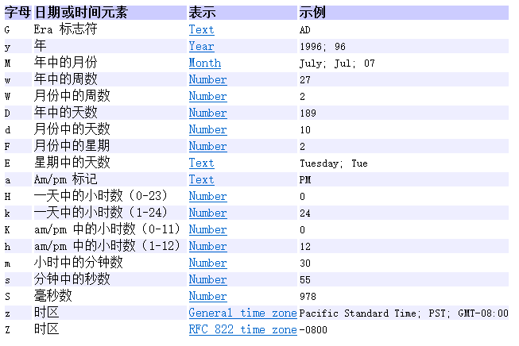
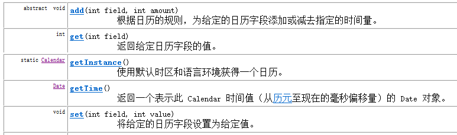
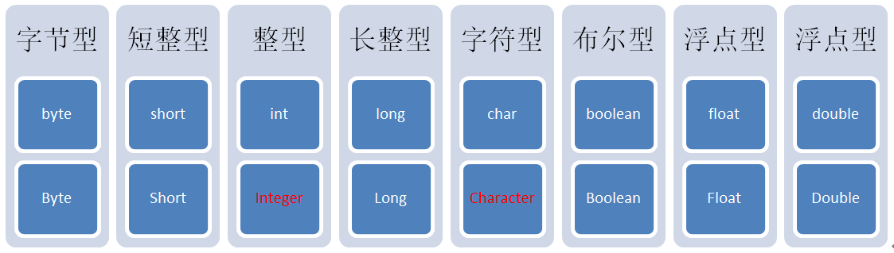

# 06-Java常用API

[TOC]

## API概述

API(Application Programming Interface) : 应用程序编程接口

Java API就是Java提供给我们使用的类，这些类将底层的实现封装了起来，我们不需要关心这些类是如何实现的，只需要学习这些类如何使用。
我们可以通过查帮助文档来了解Java提供的API如何使用

### API的使用

```
A:打开帮助文档
B:点击显示，找到索引，看到输入框
C:你要学习什么内容，你就在框框里面输入什么内容
	  举例：Random
D:看包
java.lang包下的类在使用的时候是不需要导包的
E:看类的描述
	Random类是用于生成随机数的类
F:看构造方法
	Random():无参构造方法
	Random r = new Random();
G:看成员方法
	   public int nextInt(int n):产生的是一个[0,n)范围内的随机数
		调用方法：
			看返回值类型：人家返回什么类型，你就用什么类型接收
			看方法名：名字不要写错了
			看形式参数：人家要几个参数，你就给几个，人家要什么数据类型的，你就给什么数据类型的
			int number = r.nextInt(100);
```

### Scanner类

用Scanner类的方法可以完成接收键盘录入的数据(基本数据类型，字符串数据)

1. 导包(位置放到class定义的上面)
	- A:手动导包
	
 			import java.util.Scanner;

	- B:鼠标点击红色叉叉，自动生成
	
	- C:快捷键(推荐)
	
 			ctrl+shift+o

2. 创建对象

		Scanner sc = new Scanner(System.in);

3. 接收数据

		int x = sc.nextInt();

注意：在程序的不同的地方创建多个scanner对象读取一整行信息，每次用完后调用close方法关掉，当第二个scanner对象调用nextLine时就会出现NoSuchElementException: No line found的异常。
如果第一个scanner对象不关掉，就不会报错。

public void close()关闭此扫描器，sc.close()会把System.in也关掉 
如果此扫描器尚未关闭，并且其底层 readable 也实现 Closeable 接口，则该 readable 的 close 方法将被调用。
System.in是InputStream的对象,并且关掉之后不能再打开

Java 是顺序执行的，执行到.close() 后就代表你关闭了流，再去调用已经被你关闭的流显然是不现实的

可以专门写一个类：

	class input
	{
    	final static Scanner sc=new Scanner(System.in);
	}

以后每次都调用input.sc，最后再把它关掉。

### Random类

用于产生一个随机数

-	使用步骤(和Scanner类似)
	1. 导包
	
			import java.util.Random;
	2. 创建对象
	
			Random r = new Random();

	3. 获取随机数
	
			int number = r.nextInt(10);

	- 产生的数据在0到10之间，包括0，不包括10。
	- 括号里面的10是可以变化的，如果是100，就是0-100之间的数据

### String类

在实际开发中，字符串的操作是最常见的操作，没有之一。
Java没有内置的字符串类型，所以，就在Java类库中提供了一个类String 供我们来使用。
String 类代表字符串。Java 程序中的所有字符串字面值（如 "abc" ）都作为此类的实例实现。

注意：String s = “helloworld”;s也是一个对象。

String 是 java.lang 包下的一个类，是一种引用数据类型（类，接口，数组）。字符串是常量；它们的值在创建之后不能更改。字符串缓冲区支持可变的字符串。因为 String 对象是不可变的，所以可以共享。

根据JDK的源码：
```
public final class String    
	implements java.io.Serializable, Comparable<String>, CharSequence {    
	/** The value is used for character storage. */  
	private final char value[];
```
字符串常量String就是一个char数组，内部封装了一个final修饰的char数组，并且String中所有方法的实现都是对char数组的改变。

#### String对象初始化

String类常用的构造方法有以下三种：

```
String(String original)://把字符串数据封装成字符串对象
String(char[] value)://把字符数组的数据封装成字符串对象
String(char[] value, int index, int count)://把字符数组中的一部分数据封装成字符串对象
```

还可以直接把一个字符串赋值给String类型的变量进行初始化：

	String s4 = "hello";

#### String的特别之处

字符串是一种比较特殊的引用数据类型，直接输出字符串对象输出的是该对象中的数据（其他对象直接输出的是该对象的地址值）。 
另外，为了便于字符串常量的共享和复用，在方法区中有一个字符串常量池专门用来存放字符串。

通过构造方法创建与直接赋值创建的字符串对象有什么不同呢？请看下图：


	==:
	基本数据类型：比较的是基本数据类型的值是否相同
	引用数据类型：比较的是引用数据类型的地址值是否相同

三个字符串存储的都是同一个字符串"hello"，但是s1和s2、s3所指向的地址是不同的。String s2 = "hello"; 和 String s3 = "hello"; 都在编译期间生成了字面常量和符号引用，运行期间字面常量 "hello" 被存储在运行时常量池（当然只保存了一份）。通过这种方式来将 String 对象跟引用绑定的话，JVM 执行引擎会先在运行时常量池查找是否存在相同的字面常量，如果存在，则直接将引用指向已经存在的字面常量；否则在运行时常量池开辟一个空间来存储该字面常量，并将引用指向该字面常量。　
　
而通过 new 关键字来生成对象是在堆区进行的，而在堆区进行对象生成的过程是不会去检测该对象是否已经存在的。因此通过 new 来创建对象，创建出的一定是不同的对象，即使字符串的内容是相同的。但是对于相同的字符串常量，它们最终所指向的都是常量池中的同一个字符串。

#### String类的判断功能

	boolean equals(Object obj):比较字符串的内容是否相同
		Object:是类层次结构中的根类，所有的类都直接或者间接的继承自该类。
		如果一个方法的形式参数是Object，那么这里我们就可以传递它的任意的子类对象。
	boolean equalsIgnoreCase(String str):比较字符串的内容是否相同,忽略大小写
	boolean startsWith(String str):判断字符串对象是否以指定的str开头
	boolean endsWith(String str):判断字符串对象是否以指定的str结尾

#### String类的获取功能：

	int length():获取字符串的长度，其实也就是字符个数
	char charAt(int index):获取指定索引处的字符
	int indexOf(String str):获取str在字符串对象中第一次出现的索引
	String substring(int start):从start开始截取字符串
	String substring(int start,int end):从start开始，到end结束截取字符串。包括start，不包括end
	
#### String类的转换功能

	char[] toCharArray():把字符串转换为字符数组
	String toLowerCase():把字符串转换为小写字符串
	String toUpperCase():把字符串转换为大写字符串

字符串的遍历：
 * length()加上charAt()
 * 把字符串转换为字符数组，然后遍历数组

#### 字符串分割

String[] split(String regex)根据给定正则表达式的匹配拆分此字符串
String[] split(String regex, int limit)根据匹配给定的正则表达式来拆分此字符串


#### String类的其他常用功能

- 去除字符串两端空格	

		String trim()

- 按照指定符号分割字符串	

		String[] split(String str)

### StringBuilder类

StringBuilder:是一个可变的字符串，是字符串缓冲区类。  

#### String和StringBuilder的区别

- String的内容是固定的
- StringBuilder的内容是可变的

+=拼接字符串每次拼接都会产生新的字符串对象,而利用StringBuilder来拼接字符串自始至终用的都是同一个StringBuilder容器


#### StringBuilder类的常用方法

```
 A:构造方法:
    StringBuilder()
  B:成员方法:
    public int capacity():返回当前容量 (理论值)
    public int length():返回长度(已经存储的字符个数)
	public StringBuilder append(任意类型):添加数据，并返回自身对象
	public StringBuilder reverse():反转功能
```

#### StringBuilder和String的相互转换

StringBuilder -- String
public String toString():通过toString()就可以实现把StringBuilder转成String

String -- StringBuilder
StringBuilder(String str):通过构造方法就可以实现把String转成StringBuilder

## Java集合

### 对象数组

A:基本类型的数组:存储的元素为基本类型

	int[] arr={1,2,3,4}

B:对象数组:存储的元素为引用类型

	Student[] stus=new Student[3];
	Student代表一个自定义类
	stus数组中stus[0],stus[1],stus[2]的元素数据类型为Student,都可以指向一个Student对象


### ArrayList类

A:我们学习的是面向对象编程语言，而面向对象编程语言对事物的描述都是通过对象来体现的。
为了方便对多个对象进行操作，我们就必须对这多个对象进行存储，而要想对多个对象进行存储，	就不能是一个基本的变量，而应该是一个容器类型的变量。
 	  
B:到目前为止，我们学习过了哪些容器类型的数据呢？
StringBuilder,数组。
StringBuilder的结果只能是一个字符串类型，不一定满足我们的需求。
所以，我们目前只能选择数组了，也就是我们前面学习过的对象数组。
但是，数组的长度是固定的， 如果有时候元素的个数不确定的,我们无法定义出数组的长度,这个时候，java就提供了集合类供我们使用。

集合类的特点：长度可变。

ArrayList&lt;E&gt;:大小可变数组的实现，&lt;E&gt;是一种特殊的数据类型，泛型,在出现E的地方我们使用引用数据类型替换即可

	举例：ArrayList<String>,ArrayList<Student>

构造方法

	ArrayList()

成员方法

```
添加元素
	public boolean add(E e):添加元素
	public void add(int index,E element):在指定的索引处添加一个元素
获取元素
    public E get(int index):返回指定索引处的元素
集合长度
	 public int size():返回集合中的元素的个数
删除元素
	 public boolean remove(Object o):删除指定的元素，返回删除是否成功
    public E remove(int index):删除指定索引处的元素，返回被删除的元素
修改元素
	public E set(int index,E element):修改指定索引处的元素，返回被修改的元素
```

ArrayList集合的遍历:集合的遍历思想和数组的遍历思想相同,循环遍历容器,依次取出里面的元素即可,通过size()和get()配合实现

## I/O流

IO流用来处理设备之间的数据传输
Java对数据的操作是通过流的方式
Java用于操作流的类都在IO包中
流按流向分为两种：输入流，输出流


### FileWriter类

#### FileWriter向文件中写数据

```
A:FileWriter向文件中写数据操作步骤:
      a:使用FileWriter流关联文件
      b:利用FileWriter的写方法写数据
      c:利用FileWriter的刷新方法将数据从内存刷到硬盘上
      d:利用FileWriter的关流方法将释放占用的系统底层资源
   B:FileWriter方法:
构造方法
FileWriter(String fileName) 传入一个文件的路径（包括名称）
成员方法
void write(String str) 向文件中写str
void flush()  将内存中的数据刷新到文件中
void close()  关流释放系统底层资源
```

```
//创建输出流对象
		FileWriter fw = new FileWriter("d:\\a.txt");
/*
		 * 创建输出流对象做了哪些事情:
		 * 		A:调用系统资源创建了一个文件
		 * 		B:创建输出流对象
		 * 		C:把输出流对象指向文件
		 */
		
		//调用输出流对象的写数据的方法
		//写一个字符串数据
		fw.write("IO流你好");
		//数据没有直接写到文件，其实是写到了内存缓冲区
		fw.flush();
		
		//释放资源
		//通知系统释放和该文件相关的资源
		fw.close();
```

输出流写数据的步骤：
* A:创建输出流对象
* B:调用输出流对象的写数据方法，并刷新缓冲区
* C:释放资源
 		
相对路径：相对当前项目而言的，在项目的根目录下(a.txt)
绝对路径：以盘符开始的路径(d:\\a.txt)

close()和flush()方法的区别：
 * 	flush():刷新缓冲区。流对象还可以继续使用。
 * 	close():先刷新缓冲区，然后通知系统释放资源。流对象不可以再被使用了。

#### FileWriter其它写方法

void write(String str):写一个字符串数据
void write(String str,int index,int len):写一个字符串中的一部分数据
void write(int ch):写一个字符数据,这里写int类型的好处是既可以写char类型的数据，也可以写char对应的int类型的值。'a',97
void write(char[] chs):写一个字符数组数据
void write(char[] chs,int index,int len):写一个字符数组的一部分数据

#### FileWriter写入换行以及向文本末尾追加

\n可以实现换行，但是windows系统自带的记事本打开并没有换行，这是为什么呢?因为windows识别的换行不是\n，而是\r\n
* 	windows:\r\n
* 	linux:\n
* 	mac:\r
 	
如何实现数据的追加写入?

	FileWriter(String fileName, boolean append)

### FileReader类

FileReader(String fileName):传递文件名称

输入流读文件的步骤：
A:创建输入流对象

	FileReader fr = new FileReader("fr.txt");

B:调用输入流对象的读数据方法

	int read():一次读取一个字符

如果读取数据的返回值是-1的时候，就说明没有数据了，可以作为循环的结束条件

```
int ch;
		1:fr.read()
		2:ch=fr.read()
		3:ch != -1
		while((ch=fr.read())!=-1) {
			System.out.println(ch);
			System.out.println((char)ch);
			System.out.print((char)ch);
		}
```
	
C:释放资源

	fr.close();

java.io.FileNotFoundException: fr.txt (系统找不到指定的文件。)

#### FileReader其他读方法

read(char[] cbuf) 将字符读入数组
read(char[] cbuf, int off, int len)将字符读入数组的某一部分
read(CharBuffer target) 试图将字符读入指定的字符缓冲区

#### 复制文件

	int ch;
	while((ch=fr.read())!=-1) {
		fw.write(ch);
	}//一次读写一个字符

	//用字符数组拷贝文件
	char[] chs = new char[1024];
	int len;
	while((len=fr.read(chs))!=-1) {
		fw.write(chs, 0, len);
	}


### 字符缓冲流

BufferedWriter:将文本写入字符输出流，缓冲各个字符，从而提供单个字符、数组和字符串的高效写入

	BufferedWriter bw = new BufferedWriter(new FileWriter("bw.txt"));

BufferedReader:从字符输入流中读取文本，缓冲各个字符，从而实现字符、数组和行的高效读取

	BufferedReader br = new BufferedReader(new FileReader("FileWriterDemo.java"));

#### 缓冲流的特有方法

```
BufferedWriter
 	void newLine():写一个换行符，这个换行符由系统决定,不同的操作系统newLine()方法使用的换行符不同
windows:\r\n 
linux:\n 
mac:\r
BufferedReader
 	String readLine():一次读取一行数据，但是不读取换行符

	String line;
	while((line=br.readLine())!=null) {
		array.add(line);
	}

```

### Object类

#### 概述

Object类是Java语言中的根类，即所有类的父类。其中描述的所有方法子类都可以使用。所有类在创建对象的时候，最终找的父类就是Object。
在Object类众多方法中，我们先学习equals方法与toString方法，其他方法后面课程中会陆续学到。

#### toString方法

	String toString():返回该对象的字符串表示
	return getClass().getName() + "@" + Integer.toHexString(hashCode());
	getClass():返回一个字节码对象
	Integer.toHexString():返回指定参数的十六进制字符串形式
	hashCode()：返回该对象的哈希码值（内部地址）

由于toString方法返回的结果是内存地址，而在开发中，经常需要按照对象的属性得到相应的字符串表现形式，因此需要重写它。
注意：输出一个对象就是默认输出这个对象的toString()方法

#### equals方法

	boolean equals(Object obj)：指示其他某个是否与此对象“相等”
	使用==来比较两个对象是否相等，则比较地址值是否相等

equals方法，用于比较两个对象是否相同，它其实就是使用两个对象的内存地址在比较。Object类中的equals方法内部使用的就是==比较运算符。
在开发中要比较两个对象是否相同，经常会根据对象中的属性值进行比较，也就是在开发经常需要子类重写equals方法根据对象的属性值进行比较。

### System类

#### 概述

System类提供的设施中，有标准输入、标准输出和错误输出流；对外部定义的属性和环境变量的访问；加载文件和库的方法；还有快速复制数组的一部分的实用方法。 

它不能被实例化。

#### 成员方法

```
static void arraycopy(Object src, int srcPos, Object dest, int destPos, int length) :
     从src源数组的srcPos索引开始,复制length个元素,从destPost位置开始将这些元素放至到dest数组中
static long currentTimeMillis() 
     返回以毫秒为单位的当前时间,这个毫秒的时间是相对时间，相对于1970-1-1 00:00:00 ： 0
static void exit(int status) 
     终止当前正在运行的 Java 虚拟机
static void gc()  
	运行垃圾回收器
```

### 日期相关类

#### Date类

表示特定的瞬间，精确到毫秒，他可以通过方法来设定自己所表示的时间，可以表示任意的时间

##### 构造方法

	Date() ：创建的是一个表示当前系统时间的Date对象
	Date(long date) ：根据"指定时间"创建Date对象

##### 常用方法

	void setTime(long time)  
	long getTime()

#### DateFormat类 & SimpleDateFormat类

DateFormat 是日期/时间格式化子类的抽象类，它以与语言无关的方式格式化并解析日期或时间。日期/时间格式化子类（如 SimpleDateFormat类）允许进行格式化（也就是日期 -> 文本）、解析（文本-> 日期）和标准化。我们通过这个类可以帮我们完成日期和文本之间的转换。

DateFormat 可帮助进行格式化并解析任何语言环境的日期。对于月、星期，甚至日历格式（阴历和阳历），其代码可完全与语言环境的约定无关。

##### 常用方法

要格式化一个当前语言环境下的日期也就是日期 -> 文本），要通过下面的方法来完成。DateFormat是抽象类，我们需要使用其子类SimpleDateFormat来创建对象。

	SimpleDateFormat():用默认的模式和默认语言环境的日期格式符号构造 SimpleDateFormat。
	SimpleDateFormat(String pattern):用给定的模式和默认语言环境的日期格式符号构造 SimpleDateFormat。

	DateFormat类方法：
		String format(Date date):将一个 Date 格式化为日期/时间字符串。
		Date parse(String source):从给定字符串的开始解析文本，以生成一个日期。
	注意：Exception in thread "main" java.text.ParseException:解析的字符串，模式必须和构建对象的模式一样

日期和时间格式由日期和时间模式 字符串指定。在日期和时间模式字符串中，未加引号的字母 'A' 到 'Z' 和 'a' 到 'z' 被解释为模式字母，用来表示日期或时间字符串元素。文本可以使用单引号 (') 引起来，以免进行解释。"''" 表示单引号。所有其他字符均不解释；只是在格式化时将它们简单复制到输出字符串，或者在解析时与输入字符串进行匹配。



#### Calendar类

Calendar是日历类，在Date后出现，替换掉了许多Date的方法。该类将所有可能用到的时间信息封装为静态成员变量，方便获取。

Calendar为抽象类，由于语言敏感性，Calendar类在创建对象时并非直接创建，而是通过静态方法创建，将语言敏感内容处理好，再返回子类对象，如下：

	static Calendar getInstance():使用默认时区和语言环境获得一个日历

##### 常用方法



### 包装类&正则表达式

#### 包装类

在实际程序使用中，程序界面上用户输入的数据都是以字符串类型进行存储的。而程序开发中，我们需要把字符串数据，根据需求转换成指定的基本数据类型，如年龄需要转换成int类型，考试成绩需要转换成double类型等。

Java中提供了相应的对象来实现字符串与基本数据之间转换，基本数据类型对象包装类：java将基本数据类型值封装成了对象。封装成对象有什么好处？可以提供更多的操作基本数值的功能。

8种基本类型对应的包装类如下：



其中需要注意int对应的是Integer，char对应的Character，其他6个都是基本类型首字母大写即可。

##### 包装类的常用方法

	构造方法
	Integer(int value) 
          构造一个新分配的 Integer 对象，它表示指定的 int 值。
	Integer(String s) 
          构造一个新分配的 Integer 对象，它表示 String 参数所指示的 int 值。
	成员方法
	int intValue() 
          以 int 类型返回该 Integer 的值。
	static int parseInt(String s) 
          将字符串参数作为有符号的十进制整数进行解析。
	String toString() 
          返回一个表示该 Integer 值的 String 对象。

##### 包装类的自动装箱与拆箱

在需要的情况下，基本类型与包装类型可以通用。有些时候我们必须使用引用数据类型时，可以传入基本数据类型。

基本类型可以使用运算符直接进行计算，但是引用类型不可以。而基本类型包装类作为引用类型的一种却可以计算，原因在于，Java”偷偷地”自动地进行了对象向基本数据类型的转换。
相对应的，引用数据类型变量的值必须是new出来的内存空间地址值，而我们可以将一个基本类型的值赋值给一个基本类型包装类的引用。原因同样在于Java又”偷偷地”自动地进行了基本数据类型向对象的转换。

JDK1.5特性：自动装箱和拆箱
自动拆箱：对象转成基本数值
自动装箱：基本数值转成对象

#### 正则表达式

正则表达式是专门解决字符串规则匹配的工具。
正则表达式也是一个字符串，用来定义匹配规则。
参照帮助文档，在Pattern类中有简单的规则定义，正则表达式中明确区分大小写字母，可以结合字符串类的方法使用。

##### 匹配规则

字符：x
含义：代表的是字符x
例如：匹配规则为 "a"，那么需要匹配的字符串内容就是 ”a”

字符：\\
含义：代表的是反斜线字符'\'
例如：匹配规则为"\\" ，那么需要匹配的字符串内容就是 ”\”

字符类：[abc]
含义：代表的是字符a、b 或 c
例如：匹配规则为"[abc]" ，那么需要匹配的内容就是字符a，或者字符b，或字符c的一个

字符类：[^abc]
含义：代表的是除了 a、b 或 c以外的任何字符
例如：匹配规则为"[^abc]"，那么需要匹配的内容就是不是字符a，或者不是字符b，或不是字符c的任意一个字符

字符类：[a-zA-Z]
含义：代表的是a 到 z 或 A 到 Z，两头的字母包括在内
例如：匹配规则为"[a-zA-Z]"，那么需要匹配的是一个大写或者小写字母

字符类：[0-9]
含义：代表的是 0到9数字，两头的数字包括在内
例如：匹配规则为"[0-9]"，那么需要匹配的是一个数字

字符类：[a-zA-Z_0-9]
含义：代表的字母或者数字或者下划线(即单词字符)
例如：匹配规则为" [a-zA-Z_0-9] "，那么需要匹配的是一个字母或者是一个数字或一个下滑线

预定义字符类：.
含义：代表的是任何字符
例如：匹配规则为" . "，那么需要匹配的是一个任意字符。如果，就想使用 . 的话，使用匹配规则"\\."来实现

预定义字符类：\d [0-9]
含义：代表的是 0到9数字，两头的数字包括在内，相当于[0-9]
例如：匹配规则为"\d "，那么需要匹配的是一个数字

预定义字符类：\w  [a-zA-Z_0-9]
含义：代表的字母或者数字或者下划线(即单词字符)，相当于[a-zA-Z_0-9]
例如：匹配规则为"\w "，，那么需要匹配的是一个字母或者是一个数字或一个下滑线
数量词：X?
含义：代表的是X出现一次或一次也没有
例如：匹配规则为"a?"，那么需要匹配的内容是一个字符a，或者一个a都没有

数量词：X*
含义：代表的是X出现零次或多次
例如：匹配规则为"a*" ，那么需要匹配的内容是多个字符a，或者一个a都没有

数量词：X+
含义：代表的是X出现一次或多次
例如：匹配规则为"a+"，那么需要匹配的内容是多个字符a，或者一个a

数量词：X{n}
含义：代表的是X出现恰好 n 次
例如：匹配规则为"a{5}"，那么需要匹配的内容是5个字符a

数量词：X{n,}
含义：代表的是X出现至少 n 次
例如：匹配规则为"a{5, }"，那么需要匹配的内容是最少有5个字符a

数量词：X{n,m}
含义：代表的是X出现至少 n 次，但是不超过 m 次
例如：匹配规则为"a{5,8}"，那么需要匹配的内容是有5个字符a 到 8个字符a之间

	boolean matches(String regex) ：判断当前字符串是否匹配指定的正则表达式，如果匹配则返回true，否则返回false


