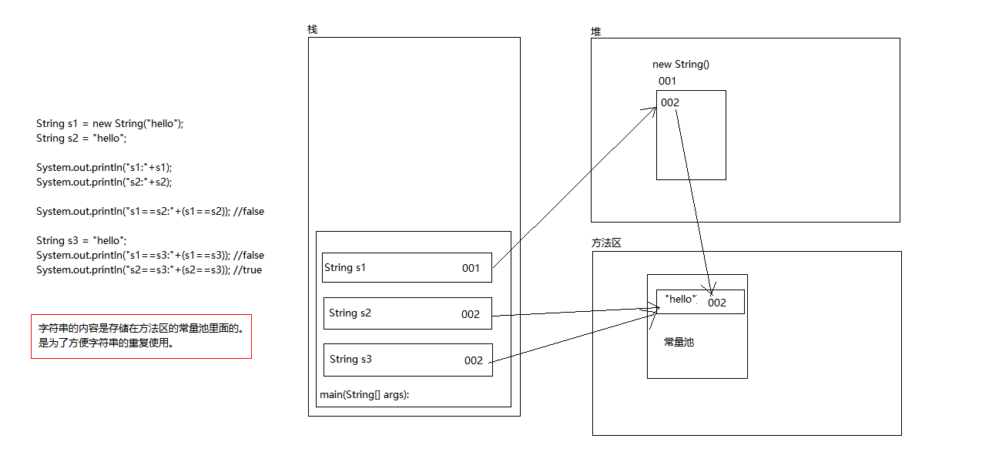

# Java基础学习笔记之String类

[TOC]

## String简介
String 是 java.lang 包下的一个类，是一种引用数据类型（类，接口，数组）。按照JDK中的定义：String 类代表字符串。Java 程序中的所有字符串字面值（如 "abc" ）都作为此类的实例实现。 字符串是常量；它们的值在创建之后不能更改。字符串缓冲区支持可变的字符串。因为 String 对象是不可变的，所以可以共享。

根据JDK的源码：
```
public final class String    
	implements java.io.Serializable, Comparable<String>, CharSequence {    
	/** The value is used for character storage. */  
	private final char value[];
```
字符串常量String就是一个char数组，内部封装了一个final修饰的char数组，并且String中所有方法的实现都是对char数组的改变。

## String对象初始化
String类常用的构造方法有以下三种：
```
String(String original)://把字符串数据封装成字符串对象
String(char[] value)://把字符数组的数据封装成字符串对象
String(char[] value, int index, int count)://把字符数组中的一部分数据封装成字符串对象
```
还可以直接把一个字符串赋值给String类型的变量进行初始化：
```
String s4 = "hello";
```
## String的特别之处
字符串是一种比较特殊的引用数据类型，直接输出字符串对象输出的是该对象中的数据（其他对象直接输出的是该对象的地址值）。 
另外，为了便于字符串常量的共享和复用，在方法区中有一个字符串常量池专门用来存放字符串。

通过构造方法创建与直接赋值创建的字符串对象有什么不同呢？请看下图：

三个字符串存储的都是同一个字符串"hello"，但是s1和s2、s3所指向的地址是不同的。String s2 = "hello"; 和 String s3 = "hello"; 都在编译期间生成了字面常量和符号引用，运行期间字面常量 "hello" 被存储在运行时常量池（当然只保存了一份）。通过这种方式来将 String 对象跟引用绑定的话，JVM 执行引擎会先在运行时常量池查找是否存在相同的字面常量，如果存在，则直接将引用指向已经存在的字面常量；否则在运行时常量池开辟一个空间来存储该字面常量，并将引用指向该字面常量。　
　
而通过 new 关键字来生成对象是在堆区进行的，而在堆区进行对象生成的过程是不会去检测该对象是否已经存在的。因此通过 new 来创建对象，创建出的一定是不同的对象，即使字符串的内容是相同的。但是对于相同的字符串常量，它们最终所指向的都是常量池中的同一个字符串。

## 键盘录入Scanner

### 键盘录入数据的步骤:

1. 导包(位置放到class定义的上面)
	import java.util.Scanner;
2. 创建对象
	Scanner sc = new Scanner(System.in);
3. 接收数据
	int x = sc.nextInt();

